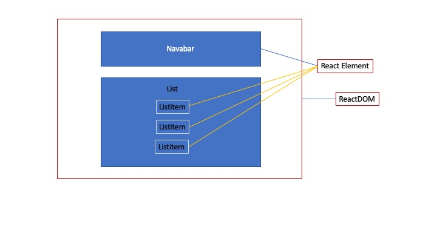

<h1>React Wiki</h1>
</br>
<h2>ComponentElement created</h2>

React二種類があり、HTML　DOM ElementとComponent Element
具体言えばHTMLDOMはReactDOM下のReactElementにざまざまなHTMLエレメントを含まれる。


しかし、Reactの主なエレメントはComponent Element。
いわゆるは自分作成です。
<br>
先ずはComponentを定義すると実体作成すると、画面に表示する。

```
//Componentを定義する
class MyHead extends React.Component{
    render(){
        return React.createElement("H1",null,"Hello Conponent");
    }
}
//実体作成して(React.createElement)、画面に表示する(ReactDOM.render)

window.addEventListener("load",() =>{

    let myComponent = React.createElement(MyHead,null);
    
    ReactDOM.render(myComponent,document.body)
  
  })
```


